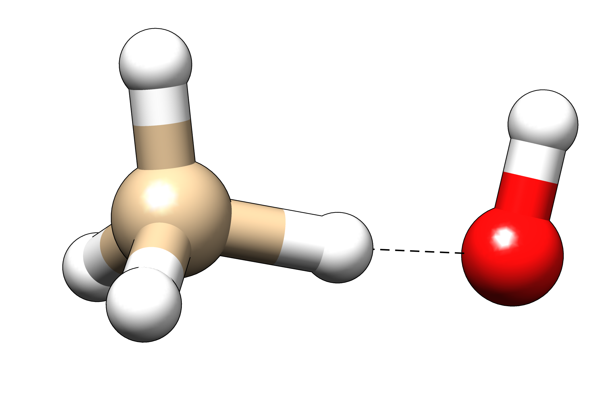
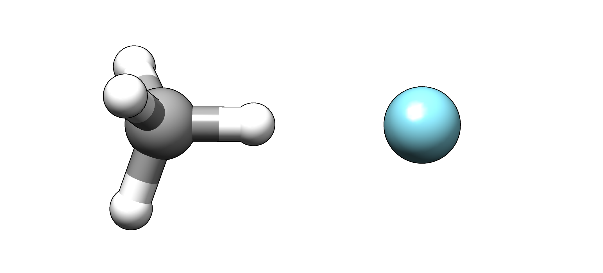
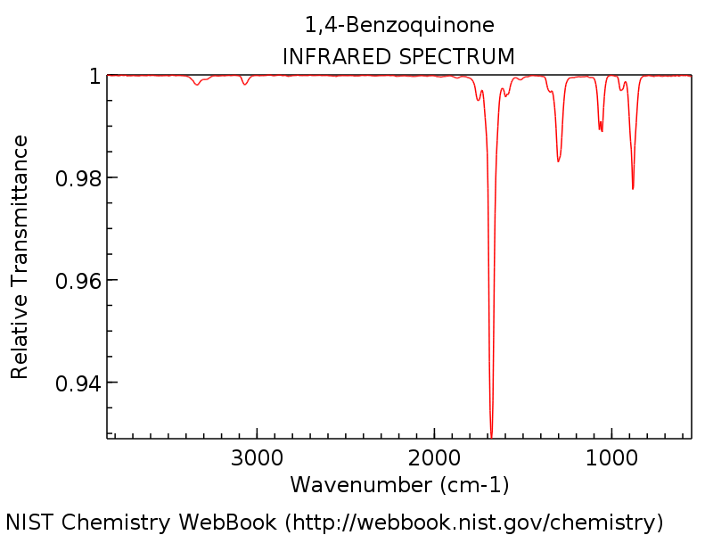
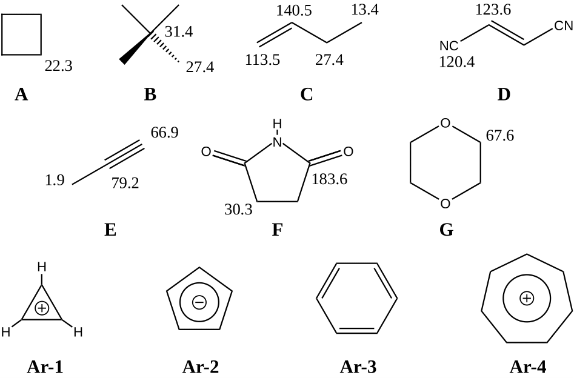

.. include:: symbols.txt

Exercises
=========

.. contents::

Electron Correlation
--------------------

Multireference Methods
~~~~~~~~~~~~~~~~~~~~~~

.. admonition:: Exercise 1.1

   Electron correlation is very important in dissociation processes
   to get qualitatively and quantitatively correct results.
   Calculate the potential energy curves for the dissociation of
   HF with the single-reference methods RHF, UHF, MP2, CCSD(T) and CASSCF,
   which is a multi-reference method. Compare the results.

**Approach**

1. In order to easily calculate potential energy curves, we use ORCA.
   Create the following inputs for the given methods and save them in different directories.
   (*e.g.* ``rhf.inp``, ``uhf.inp``, etc.).

   Input for RHF:

   .. code-block:: none
      :linenos:

      ! RHF def2-TZVP TightSCF

      %paras R= 4.0,0.5,35 end

      * xyz 0 1
      H 0 0 0
      F 0 0 {R}
      *

   Modifications for

   UHF:

   .. code-block:: none
      :linenos:

      ! UHF def2-TZVP TightSCF

      %scf BrokenSym 1,1 end

   MP2:

   .. code-block:: none
      :linenos:

      ! RHF MP2 def2-TZVP TightSCF

   CCSD(T):

   .. code-block:: none
      :linenos:

      ! RHF CCSD(T) def2-TZVP TightSCF

   CASSCF (2 active electrons in 2 orbitals):

   .. code-block:: none
      :linenos:

      ! RHF def2-TZVP TightSCF Conv

      %casscf
        nel 2
        norb 2
        switchstep nr
      end

   Calculate the potential energy curve by a CASSCF calculation with 6 electrons (``nel``) in 6 active orbitals (``norb``) as well.

2. Call ORCA with the command

   .. code-block:: none

      orca <file>.inp > <file>.out

3. Plot the resulting potential energy curves *e.g.* using ``gnuplot`` (see section
   :ref:`Plotting`). To do so, delete the first line in the files ``<filename>.trj*.dat``
   to read them (find out which file is the right one yourself).

4. Calculate the energies for hydrogen and fluorine atoms for all given methods.
   Which methods will yield the identical energies for the hydrogen atom?

5. Plot the curves relative to the energies of the individual atoms and discuss your results
   (particularly the energies at large distances).

.. hint::

   Have a closer look at the UHF dissociation curve. Does it look as you would expect it?
   Try to explain the "strange" behavior in terms of symmetry breaking.

.. hint::

   If you encounter convergence problems in the CAS(6,6) calculations, try increasing the
   maximum number of macro-iterations for CASSCF by adding the following keyword in the
   ``%casscf`` block:

   .. code-block:: none
      :lineno-start: 6

        maxiter 1000

Carbenes
~~~~~~~~

All following calculations will be done with TURBOMOLE if not stated otherwise. Also, if not
specified otherwise we will use the RI approximation and C\ :sub:`1` symmetry throughout.

.. admonition:: Exercise 1.2

   Calculate the singlet-triplet splitting of methylene and *p*-benzyne with HF, MP2,
   DFT and CCSD(T).

**Approach**

1. Create the file ``coord`` with starting geometries for Methylene and *p*-Benzyne.

   The syntax is:

   .. code-block:: none
      :linenos:

      $coord
      x y z atom1
      x y z atom2
      ...
      ...
      $end

   You can either create the files by hand or use the program ``Avogadro`` for this purpose
   (see section :ref:`Software for visualization of molecules`). ``Avogadro`` uses
   |angst| as unit, but the unit for the ``coord`` file has to be bohr (atomic units). To
   convert a \*.xyz file into a coord file you can use the command

   .. code-block:: none

      x2t *.xyz > coord

   This also works the other way round:

   .. code-block:: none

      t2x coord > *.xyz

   .. image:: img/carbenes.png
      :align: center
      :height: 125px

2. **Methylene**: Optimize the geometries of the singlet and the triplet state
   with the given methods (HF, TPSS, B3LYP, PW6B95, MP2) and the basis set def2-TZVP.
   The following input is an example of a ``control`` file with the correct options
   for a B3LYP/def2-TZVP calculation of the triplet (= 2 unpaired electrons) state.

   .. code-block:: none
      :linenos:

      $coord file=coord
      $eht charge=0 unpaired=2
      $symmetry c1
      $atoms
        basis=def2-TZVP
      $dft
        functional b3-lyp
      $rij
      $energy file=energy
      $grad file=gradient
      $end

   | To generate the input for the other calculations, please look at the table provided
     in section :ref:`Keywords in control`. For the MP2 calculations, exchange the ``$dft``
     with the proper ``$ricc2`` block and don't forget to specify ``$denconv`` small enough.
   | Geometry optimizations (DFT, HF) are done with the program ``jobex``:

   .. code-block:: none

      jobex -ri > jobex.out

   Note that for MP2 geometry optimizations, you have to add the ``-level cc2`` option.
   Energies after geometry optimizations can be found in the file ``job.last``. HF and DFT
   energies for each SCF-cycle are additionally written in the file ``energy``.
   In the case of CCSD(T) (also defined via the ``$ricc2`` block), do not perform a geometry
   optimization, but do a single-point calculation on the MP2 optimized geometries. Before
   performing the actual CCSD(T) calculation, you have do run a HF-SCF:

   .. code-block:: none

      ridft > ridft.out
      ccsdf12 > ccsdf12.out

   The energies can then be found in ``ccsdf12.out``.

3. In order to measure the angles of the optimized structures, you can use ``Avogadro``
   or a small TURBOMOLE script called ``bend``:

     .. code-block:: none

        bend i j k

   | with atom numbers ``i``, ``j``, ``k``.
   | Note down the HCH-angle and total energies for each method, as well as the singlet-triplet splitting (:math:`\Delta E_\text{S-T} = E_\text{singlet} - E_\text{triplet}`). The experimental value for the splitting is 9.0 kcal\ |mult|\ mol\ :sup:`-1`. The experimentally found angles are 102.4° for the singlet and 135.5° for the triplet.

4. **p-Benzyne**: Repeat the same calculations for *p*-benzyne. The experimental value
   for the splitting is -4.2 kcal\ |mult|\ mol\ :sup:`-1`.

5. Discuss your findings and compare them to the experiment.

.. hint::

   A HF calculation can be performed by simply omitting the ``$dft`` block in the above
   input file. For post HF calculations, add the ``$ricc2`` block:

   .. code-block:: none
      :linenos:

      $ricc2
        mp2                # or ccsd(t)
        geoopt model=mp2   # only for MP2 geometry optimizations
       
.. hint::

   If you encounter convergence problems in the MP2 or CCSD(T) calculations, try to increase the
   maximum number of SCF cycles (e.g. 100) by adding the following keyword:

   .. code-block:: none
      :linenos: 

        $scfiterlimit <limit>

Basis Set Convergence
---------------------

Formic Acid Dimer
~~~~~~~~~~~~~~~~~

.. admonition:: Exercise 2.1

   Investigate the basis set convergence behavior of different methods
   for the formic acid dimer.

**Approach**

1. Create separate directories for the formic acid dimer and monomer and set up geometry
   optimizations on the TPSS-D3/def2-TZVP level of theory. To do so, create structures
   using *e.g.* ``Avogadro`` and convert them to ``coord`` files. Prepare the calculations
   in the same way as in exercise 1.2. You can use a similar ``control`` file and add the
   ``$disp3 -bj`` keyword for the D3 dispersion correction. **DFT** geometry optimizations
   are performed via:

   .. code-block:: none

      jobex -ri > jobex.out

2. Using the optimized geometries, calculate the dimerization energy (energy difference
   of one dimer and two monomers) with HF, TPSS-D3 and MP2 employing the cc-pVXZ (X = D, T, Q)
   basis sets and their augmented counterparts (aug-cc-pVXZ). Refer to the table of input
   options given in section :ref:`Keywords in control`.

3. Tabulate your results and plot the total energies versus the cardinal number
   of the basis set for each method (*e.g.* with ``gnuplot``).

4. Discuss your findings with respect to the basis set superposition error (BSSE) and
   the basis set incompleteness (BSIE). Which methods can be considered as converged
   towards the basis set limit when used with a quadruple-|zeta| basis?

.. hint::

   - The calculations with quadruple-|zeta| basis can be quite time consuming. Exploiting the
     symmetry by choosing the correct point group in the ``$symmetry`` block might accelerate
     the calculations.

   - Remember that you have to perform a HF single-point calculation (using ``ridft``) before
     you can start the MP2 calculation with ``ricc2`` in the same directory.

Thermochemistry
---------------

Reaction Enthalpies of Gas-Phase Reactions
~~~~~~~~~~~~~~~~~~~~~~~~~~~~~~~~~~~~~~~~~~

.. admonition:: Exercise 3.1

   For small molecules, highly accurate thermochemical results are
   reachable in quantum chemistry. This means *chemical accuracy*
   with an error of less than 1 kcal/mol. Calculate the reaction enthalpies
   at 298 K for the following, industrially important reactions:

   .. How can I center the following two lines of text?

   .. line-block::

      CH\ :sub:`4` + H\ :sub:`2`\ O |eqarr| CO + 3 H\ :sub:`2` (steam reforming of methane)
      N\ :sub:`2` + 3 H\ :sub:`2` |eqarr| 2 NH\ :sub:`3` (Haber-Bosch process)

   The experimental data are:

   +-----------------+--------------------------------------------------------------------+
   | Reaction        | :math:`\Delta H_{r}(298\,\text{K})` / kcal\ |mult|\ mol\ :sup:`-1` |
   +=================+====================================================================+
   | Steam reforming | +49.3                                                              |
   +-----------------+--------------------------------------------------------------------+
   | Haber-Bosch     | -22.5                                                              |
   +-----------------+--------------------------------------------------------------------+

**Approach**

1. Optimize the reactants and products using TPSS-D3/def2-TZVP (see earlier exercises
   and section :ref:`Keywords in control`, keep in mind the ``$disp3 -bj`` keyword).

2. In order to get the thermal corrections from energy to enthalpy at 298 K, do a
   frequency calculation first. Use the program ``aoforce`` to calculate the vibrational
   frequencies in TURBOMOLE:

   .. code-block:: none

      aoforce > aoforce.out

3. Then, calculate the thermal enthalpy corrections :math:`\Delta H_{298}` with the program
   ``thermo``. It needs a ``.thermorc`` input file from your home directory. Create this
   file by typing:

   .. code-block:: none

      echo "0.0  298.15  1.0" > ~/.thermorc

   The first number is an internal threshold, the second the temperature in Kelvin and
   the third the scaling factor for the vibrational frequencies (1.0 for TPSS). Pipe the
   output into a separate file, *e.g.*:

   .. code-block:: none

      thermo > thermo.out

4. Repeat the optimization for the molecules involved in the Haber-Bosch process with
   MP2/def2-TZVP. Calculate the deviation of these differently optimized structures by
   computing the root mean square deviation of the coordinates:

   .. code-block:: none

      rmsd <tpss-geometry> <mp2-geometry>

5. Calculate single-point energies with the hybrid functional B3LYP-D3/def2-TZVP and with
   MP2/def2-TZVP. Use the TPSS-D3 geometries and thermal corrections to calculate the
   reaction enthalpies.

6. Calculate single-point energies with the double hybrid B2PLYP-D3/def2-QZVP and with
   CCSD(T)/def2-QZVP. Use the TPSS-D3 geometries and thermal corrections to calculate the
   reaction enthalpies. Keep in mind that you have to run an SCF first with ``ridft``.
   Afterwards, use ``ricc2`` for the double-hybrid and ``ccsdf12`` for the coupled cluster
   calculation. The energies can be found in the respective output.

7. Tabulate your results and compare to the experimental values. Which method would you expect
   to show the smallest deviation to the experiment? Do your findings match your expectation?
   Disscuss your outcome.

Heat of Formation of C\ :sub:`60` (optional)
~~~~~~~~~~~~~~~~~~~~~~~~~~~~~~~~~~~~~~~~~~~~

.. admonition:: Exercise 3.2

   Calculate the heat of formation :math:`\Delta H_f^0` of the C\ :sub:`60` molecule
   by using different methods.

**Approach**

1. Optimize the geometry of C\ :sub:`60` on the TPSS-D3/def2-SVP level in I\ :sub:`h`
   symmetry. In order to do so you can build a ``coord`` file on your own or search for
   a proper input on the internet. The symmetry can be defined with the ``$symmetry ih``
   keyword in ``control``.

2. Calculate the energy of C\ :sub:`60` on TPSS/def2-SVP level without D3 corrections, use the
   TPSS-D3/def2-SVP optimized geometry.

3. Calculate the frequencies of C\ :sub:`60` and the thermal corrections the same way as in
   exercise 3.1.

4. Now, calculate the energy of a single carbon atom on the TPSS/def2-SVP
   level of theory and the thermal corrections to :math:`\Delta H_{298.15}` (use C\ :sub:`1` symmetry).

5. Calculate :math:`\Delta H_f^0` of C\ :sub:`60` and compare to experimental
   results (599 / 635 kcal/mol). You will need the experimental :math:`\Delta H_f^0`
   of a carbon atom: 170.89 kcal/mol.

6. Calculate single-point energies (without dispersion correction) for carbon and C\ :sub:`60` with TPSS and HF
   employing the def2-TZVP and the def2-QZVP basis sets.
   Use the results to calculate the heat of formation. (Use the TPSS-D3/def2-SVP geometries
   and corrections to :math:`\Delta H_{298.15}` for this purpose.)

   .. (If you run into convergence problems setting the option ``$scfconv 8`` in the control file and increasing the number of allowed scf iterations to ``$scfiterlimit 200`` may help.)

7. Calculate the D3 dispersion correction to the TPSS/def2-QZVP energy and calculate
   :math:`\Delta H_f^0` again. Use the standalone program ``dftd3``:

   .. code-block:: none

      dftd3 coord -func tpss -bj

8. Discuss your results.

Kinetics
--------

Kinetic Isotope Effect
~~~~~~~~~~~~~~~~~~~~~~

.. admonition:: Exercise 4.1

   Calculate the kinetic isotope effect for the reaction
   CH\ :sub:`4` + HO\ |mult| |irarr| |mult|\ CH\ :sub:`3` + H\ :sub:`2`\ O. From transition
   state theory, it is known that

  .. math::

     \frac{k_\text{H}}{k_\text{D}} = e^{-\frac{\Delta H^{\neq}_\text{H}-\Delta H^{\neq}_\text{D}}{RT}}.

   Geometry of the transition state.

**Approach**

1. Calculate the geometry of the transition state for the hydrogen transfer.
   In order to do this, create a ``coord`` file with a starting geometry
   that is similar to the one in the picture, with
   :math:`R_{C-H} \approx` 1.2 |angst| and :math:`R_{O-H} \approx` 1.3 |angst|.

   In order to find the transition state, use the following steps:

   (a) Prepare a ``control`` file. Use the B3LYP-D3/def2-TZVP level of theory.
       Look at section :ref:`Keywords in control` if you are unsure. You might
       need to increase the ``$scfiterlimit`` in this exercise.

   (b) Consecutively, calculate energy, gradient and hessian:

       .. code-block:: none

          ridft > ridft.out
          rdgrad > rdgrad.out
          aoforce > aoforce.out

   (c) Verify that there is at least one, relatively large imaginary frequency
       in the output of ``aoforce`` (it also appears in the ``vibspectrum`` file).
       Then, add the following block to the ``control`` file.

       .. code-block:: none
          :linenos:

          $statpt
            itrvec 1

       (in general the frequency mode describing the motion of the reaction)

   (d) Start the transition state search:

       .. code-block:: none

          jobex -ri -trans > jobex.out

2. When the search is successful (a ``GEO_OPT_CONVERGED`` file has been created
   in the directory), calculate the vibrational frequencies of the transition
   state (``aoforce``) and verify that there is only one imaginary frequency.
   You can have a look at that corresponding normal mode by calling:

   .. code-block:: none

      tm2molden

   Choose your desired options in the short interactive experience. You do not need
   to pick a name for the input file or to save the MO data, the latter will make
   the file rather large (but obviously save the frequency data). You can open the
   resulting file (default: ``molden.input``) with ``gmolden``. The normal modes can
   be visualized by clicking on "Norm. Mode" on the right side of the menu.

3. Call the program ``thermo`` and note down the thermal corrections to the enthalpy.

4. Repeat the transition state search with CD\ :sub:`4` and OH. Therefore, take the initial
   ``control`` file and add an additional non-default atom weight definition to the 4 affected
   hydrogen atoms in the ``$atoms`` block. You need to look in the ``coord`` file and identify
   the indices of the ``h`` atoms you want to change to deuterium. Say these hydrogen atoms
   are atoms 2, 3, 4 and 5, then change the ``$atoms`` block to:

   .. code-block:: none
      :linenos:

      $atoms
        basis=def2-TZVP
      h 2,3,4,5
        mass=2.014

5. With this input, repeat all aforementioned steps.

6. Calculate the energies and thermal corrections for CH\ :sub:`4`, CD\ :sub:`4` and OH.

7. Finally, calculate :math:`k_\text{H}/k_\text{D}`.

..
  Measurements of the 13C and D kinetic isotope effects (KIE) in methane, 13CKIE
  = k(12CH4)/k(13CH4) and DKIE = k(12CH4)/k(12CH3D), in the reactions of these
  atmospherically important methane isotopomers with O(1D) and OH have been
  undertaken using mass spectrometry and tunable diode laser absorption
  spectroscopy to determine isotopic composition. For the carbon kinetic isotope
  effect in the reaction with the OH radical, 13CKIEOH = 1.0039 (±0.0004, 2σ) was
  determined at 296 K, which is significantly smaller than the presently accepted
  value of 1.0054 (±0.0009, 2 σ). For DKIEOH we found 1.294 (± 0.018, 2σ) at 296
  K, consistent with earlier observations. The carbon kinetic isotope effect in
  the reaction with O(1 D) 13CKIEO(1D), was determined to be 1.013, whereas the
  deuterium kinetic isotope effect is given by DKIEO(1D) = 1.06. Both values are
  approximately independent of temperature between 223 and 295 K. The room
  temperature fractionation effect 1000(KIE-1) in the reaction of O(1 D) with
  12CH4 versus CH4 is thus ≈ 13‰, which is an order of magnitude greater than the
  previous value of 1‰. In combination with recent results from our laboratory on
  13CKIE and DKIE for the reaction of CH4 with Cl, these new measurements were
  used to simulate the effective kinetic isotope effect for the stratosphere with
  a two-dimensional, time dependent chemical transport model. The model results
  show reasonable agreement with field observations of the 13CH4/12CH4 ratio in
  the lowermost stratosphere, and also reproduce the observed CH3D/CH4 ratio.

Solvation
---------

S\ :sub:`N`\ 2-Reaction
~~~~~~~~~~~~~~~~~~~~~~~

.. admonition:: Exercise 5.1

   Calculate the potential energy curve for the S\ :sub:`N`\ 2-reaction of chloromethane
   with a flouride anion in the gas-phase and in methanol (|eps| = 32) between
   :math:`r(\text{C}-\text{F})` = 2.25 and 8.00 bohr with |eps| being the dielectric constant of the solvent.

**Approach**

1. Create structures and calculate the energies of the reactants (one calculation
   for each reactant) in the gas-phase and at |eps| = 32 (methanol). Use the hybrid
   functional PW6B95 with a def2-TZVP basis and D3 dispersion correction. Keep in
   mind that you also have to specify the charge and the solvent model in the ``control``
   file, *e.g.*:

   .. code-block:: none
      :linenos:

      $eht charge=-1 unpaired=0
      $cosmo
        epsilon=32.0

2. To create the potential energy curves, use the shell script below. The script
   loops over all distances. For each distance it creates a new directory, performs
   the constrained geometry optimization and writes the electronic energy (not
   necessarily your final reaction energy) into a file called ``results.dat``.
   Create a new directory and copy and paste the script to a file named ``run-scan.sh``.

   .. code-block:: bash
      :linenos:

      #!/usr/bin/env bash

      # Choose directory here
      calc_dir=scan_vac

      cd $calc_dir
      if [ -f ./results.dat ]
      then
        rm results.dat
      fi

      read -r -d 'END' template <<-EOF
      \$coord
         0.00000000      0.00000000      0.00000000  c f
         0.00000000      0.00000000     -3.36989165  cl
         0.00000000      0.00000000      DIST        f f
        -1.00404366      1.73905464     -0.62462166  h
        -1.00404366     -1.73905464     -0.62462166  h
         2.00808733      0.00000000     -0.62462166  h
      \$end
      END
      EOF

      for dist in $(seq 2.25 0.25 8.00 | sed s/,/./)
      do

        # Check for existence of folder
        if [ -d $dist ]
        then
          rm -r $dist
        fi
        mkdir $dist
        cp control $dist
        pushd $dist
        echo "$template" | sed "s/DIST/$dist/" > coord

        jobex -ri -c 50

        # Get final energy
        e=$(sdg energy | tail -1 | gawk '{printf $2}')

        # Write energy to a file
        echo $dist $e >> ../results.dat
        popd

      done

   A template for the ``coord`` file is given directly inline in the script, we will
   repeat it here to explain a few details. The ``f`` after the atom specification
   tells TURBOMOLE to keep the coordinates fixed for that atom. ``DIST`` ist a placeholder
   which will be substituted by the C--F distance.

   .. code-block:: none
      :lineno-start: 13

      $coord
         0.00000000      0.00000000      0.00000000  c f
         0.00000000      0.00000000     -3.36989165  cl
         0.00000000      0.00000000      DIST        f f
        -1.00404366      1.73905464     -0.62462166  h
        -1.00404366     -1.73905464     -0.62462166  h
         2.00808733      0.00000000     -0.62462166  h
      $end

   In order to use the script, you have to make it executable by typing:

   .. code-block:: none

      chmod +x run-scan.sh

   Create subdirectories (*e.g.* ``scan_vac`` and ``scan_cosmo``) for each potential
   energy curve and place a proper ``control`` file in each of these subdirectories.
   You will have to adapt the script to your directory names (name in line 4). The
   ``results.dat`` file will be written to the respective subdirectory.
   Execute the script by typing:

   .. code-block:: none

      ./run-scan.sh

3. Plot the two curves together (normalize the curves reasonably) and discuss the
   results. Estimate the activation barrier for both cases.

.. hint::

   If the execution of such a script takes some longer time, consider calling it with:

   .. code-block:: none

      nohup ./run-scan.sh &

   Then, you can log out of your shell without killing the calculation.

Activation Energies
-------------------

Rearrangement and Dimerization Reactions
~~~~~~~~~~~~~~~~~~~~~~~~~~~~~~~~~~~~~~~~

.. admonition:: Exercise 6.1

   Estimate the activation energy for the Claisen rearrangement of allyl-vinyl ether
   and the dimerization of cyclopentadiene to *endo*-dicyclopentadiene (Diels-Alder).

.. Ggf. besser Strukturen hinterlegen, Änderungen auf GFN-xTB?
.. (You can ask the lab assistent for a dimer structure of cyclopentadien.)

**Approach**

1. Construct the geometry of reactant(s) and product for each reaction (*e.g.* using ``Avogadro``).
   Ensure that the sequence of atoms is the same in every pair of reactant and product structure.

   .. hint::

      Preparing good input structures for transition state searches is absolutely essential,
      often you can easily create a product structure from your reactant. Furthermore, this
      generally eases the sorting of the atoms.

2. Optimize the geometries using GFN2-xTB. GFN2-xTB is a semi-empirical tight-binding based method
   that employs a minimal valence basis set and is very efficient for calculating **G**\ eometries,
   vibrational **F**\ requencies and **N**\ oncovalent interactions. For running the geometry optimization, call

   .. code-block:: none´
      
      xtb start.xyz --opt > opt.out
     
   The optimized geometry is written to the file ``xtbopt.xyz``.

3. Verify that the sequence of atoms is still the same in every pair of reactant and product structure.

4. Perform a reaction path search with the double-ended Growing String Method (GSM)
   at the GFN2-xTB level:

   (a) Create a directory for each reaction.
   (b) Have your optimized reactant and product structure sorted and available in xyz
       format (*e.g.* starting structure ``start.xyz``, ending structure ``end.xyz``).
   (c) Create a directory ``scratch`` and store the starting and ending structures in 
       the file ``initial0000.xyz``:
       
       .. code-block:: none
          
          cat start.xyz end.xyz >> scratch/initial0000.xyz
          
   (d) Place a file named ``ograd`` in the respective directory with the following content:
   
       .. code-block:: none
          :linenos:
          
          #!/bin/bash 
          ofile=orcain$1.in 
          ofileout=orcain$1.out 
          molfile=structure$1 
          ncpu=$2 
          basename="${ofile%.*}" 
          ########## XTB/TM settings: ################# 
          cd scratch 
          wc -l < $molfile > $ofile.xyz 
          echo "Dummy for XTB/TM calculation" >> $ofile.xyz 
          cat $molfile >> $ofile.xyz 
 
          xtb $ofile.xyz -grad  > $ofile.xtbout 
 
          tm2orca.py $basename 
          rm xtbrestart 
          cd ..

       The ``ograd`` file has to be made executable: 
      
       .. code-block:: none
           
           
          chmod u+x ograd
           
   e) Place a file named ``inpfileq`` in the respective directory with the following content:
    
      .. code-block:: none
          :linenos:
          
          # FSM/GSM/SSM inpfileq
          
          ------------- QCHEM Scratch Info ------------------------
          $QCSCRATCH/    # path for scratch dir. end with "/" 
          GSM_go1q       # name of run
          ---------------------------------------------------------
          
          ------------ String Info --------------------------------
          SM_TYPE                 GSM    # SSM, FSM or GSM
          RESTART                 0      # read restart.xyz
          MAX_OPT_ITERS           160     # maximum iterations
          STEP_OPT_ITERS          30     # for FSM/SSM
          CONV_TOL           	    0.0005 # perp grad
          ADD_NODE_TOL		    0.1    # for GSM
          SCALING			        1.0    # for opt steps
          SSM_DQMAX               0.8    # add step size
          GROWTH_DIRECTION        0      # normal/react/prod: 0/1/2
          INT_THRESH              2.0    # intermediate detection
          MIN_SPACING             5.0    # node spacing SSM
          BOND_FRAGMENTS          1      # make IC's for fragments
          INITIAL_OPT             0      # opt steps first node
          FINAL_OPT               150    # opt steps last SSM node
          PRODUCT_LIMIT           100.0  # kcal/mol
          TS_FINAL_TYPE           0      # any/delta bond: 0/1
          NNODES			        15      # including endpoints
          ---------------------------------------------------------
               
               
      For the Claisen rearrangement, you can change the ``TS_FINAL_TYPE`` option from 0 to 1 to force
      GSM to break a bond upon the transition state search. The number of 
      nodes (keyword ``NNODES``) can be increased for a more refined search, which (of course) leads to 
      longer computing time. In most cases, 15 nodes should be sufficient to find a good guess for the transition state.
       
   (f)   Start the transition state search by typing:
   
         .. code-block:: none
            
            gsm.orca 
            
            
   (g)   After the calculation, you can find the reaction path in the file
         ``stringfile.xyz0000``, and the transition state in ``scratch/tsq0000.xyz``.
       
5. Prepare relative energy diagrams for both reactions (relative energy vs. reaction coordinate),
   depict the molecular structures of both transition states and highlight the most important
   bond distances.

6. Calculate the activation energy for each reaction.

7. Perform single-point calculations on the starting structure and transtion state structure
   with PW6B95-D3/def2-TZVP using TURBOMOLE. Compare the DFT activation energy with the GFN2-xTB
   energy and discuss the differences.

8. How would you proceed further to gain more reliable numbers?

9. How feasible is this approach? Where do you see its limits in applicability and usefulness?

Noncovalent Interactions
------------------------

Noble Gas |mult| |mult| |mult| Methane
~~~~~~~~~~~~~~~~~~~~~~~~~~~~~~~~~~~~~~

.. admonition:: Exercise 7.1

   Calculate potential energy curves of the "weak" interactions between the noble gases Ar or Kr and methane.

   Geometry of the CH\ :sub:`4` |mult| |mult| |mult| Ar complex.

**Approach**

1. | Calculate the potential energy curve at the BLYP-D3/def2-QZVP level for Ar
     |mult| |mult| |mult| HCH\ :sub:`3` by performing a geometry optimization with a
     fixed Ar and H atom. Do this for :math:`R_\text{(Ar-H)}` = 4.5 - 15.0 bohr with
     a stepsize of 0.25 bohr.
   | Use the ``run-scan.sh`` script from exercise 5.1 and adopt it to this task.
     Substitute the template molecular geometry by the following one:
   
   .. code-block:: none
      :lineno-start: 13

      $coord
         0.00000000000000      0.00000000000000      DIST                  ar f
         0.00000000000000      0.00000000000000      0.00000000000000      h f
         0.00000000000000      0.00000000000000     -2.06945348098289      c
         0.97576020317533      1.69006623336522     -2.75977586481614      h
         0.97576020317533     -1.69006623336522     -2.75977586481614      h
        -1.95152040635065      0.00000000000000     -2.75977586481614      h
      $end

   You also have to modify the directory names and the distances. Prepare a ``control`` file
   for the BLYP-D3/def2-QZVP calculations including the ``$disp3 -bj`` and ``$symmetry c1``
   keywords.

2. Repeat the calculations for BLYP/def2-QZVP and MP2/def2-QZVP. For BLYP, just omit
   the ``$disp3`` block. For MP2, clear the ``$dft`` and ``$disp3`` blocks and insert proper
   settings under ``$ricc2`` and ``$denconv``. In the latter case, don't forget to change
   the ``jobex`` command in the script to:

   .. code-block:: none
      :lineno-start: 37

        jobex -ri -level cc2 -c 50

   To get the final MP2 energy for each distance, also change the ``sdg`` command to:

   .. code-block:: none
      :lineno-start: 40

        e=$(grep "Total Energy" job.last | gawk '{print $4}')

3. Repeat the calculations for Kr |mult| |mult| |mult| HCH\ :sub:`3`
   (substitute ``ar`` by ``kr`` in the template) with BLYP-D3/def2-QZVP,
   BLYP/def2-QZVP and MP2/def2-QZVP.

4. Plot the curves (**normalize to the dissociation limit**) and discuss your findings.

Spectroscopy
------------

IR-Spectrum of 1,4-Benzoquinone
~~~~~~~~~~~~~~~~~~~~~~~~~~~~~~~

.. admonition:: Exercise 8.1

   Calculate the IR-spectrum of 1,4-benzoquinone using
   DFT and HF, and compare the results to the experimental
   spectrum given below.

**Approach**

1. Create a ``coord`` file for 1,4-benzoquinone.

2. Optimize the geometry with TURBOMOLE on the HF-D3/def2-SVP level of theory.

3. Calculate the normal modes with ``aoforce``.

4. Call ``tm2molden`` and check the normal modes with ``gmolden`` the same way as
   in exercise 4.1.

5. Assign each dipole-allowed normal mode to an experimental one
   and calculate the scaling factor :math:`f_\text{scal}=\nu_\text{exp}/\nu_\text{calc}`.

6. Repeat everything with TPSS-D3/def2-SVP and discuss your findings.

   IR spectrum of 1,4-benzoquinone in KBr.

.. hint::

   If you obtain imaginary frequencies, try to start the geometry optimization from a
   slightly distorted structure. Check if the imaginary frequencies vanish.

The Color of Indigo
~~~~~~~~~~~~~~~~~~~

.. admonition:: Exercise 8.2

   Calculate the color of indigo with three different methods:
   time-dependent Hartree-Fock (TD-HF) and
   time-dependent DFT (TD-DFT) with two different functionals (PBE and PBE0).

**Approach**

1. In this exercise, please use TURBOMOLE's interactive input generator ``define`` to
   create the ``control`` file. To do so, create the geometry of an indigo molecule
   (figure below) and place the ``coord`` file in its own directory.
   
   .. figure:: img/indigo.png
      :align: center
      :width: 250px

      Structure of indigo.

   To start the input generator, navigate to the directory containing the ``coord`` file,
   type the following command and answer all questions that appear.

   .. code-block:: none

      define

   Prepare an input on the TPSS-D3/def2-SVP level and optimize the geometry. In the define
   dialogue, you can skip the first two questions, then choose the input geometry file via:

   .. code-block:: none

      a coord

   | In this menu, you will find a header telling you the number of atoms of your molecule
     and its symmetry point group (Schoenflies symbol). If this is not yet correct (the
     molecule does not have C\ :sub:`1` symmetry), type ``desy 1d-3`` or some larger value
     to loosen the symmetry determination threshold until the correct point group is recognized.
     If the symmetry is still not recognized correctly, you can set the point group manually
     with the ``sy`` command. In this case make sure TURBOMOLE does not add atoms to your
     ``coord`` file.
   | Leave the molecular geometry menu and then do not choose internal coordinates. In the
     atomic attribute definition menu, you can choose the same basis for all atoms by
     typing *e.g.*:

   .. code-block:: none

      b all def2-SVP

   Afterwards, choose an extended Hückel guess for the MOs with default parameters (don't
   worry about a small HOMO/LUMO gap). In the last general menu, go to the ``dft`` submenu
   and type *e.g.*:

   .. code-block:: none

      on
      func tpss

   Don't forget to also choose the ``bj`` option in the ``dsp`` submenu for the D3 disperion
   correction (activating the RI approximation in the ``ri`` submenu is also recommended).
   When you are finished, you will find a ``control`` file in your directory containing all
   keywords you already know and more. If everything is correct, you are now ready to run
   the geometry optimization.

   .. hint::

      Try to navigate through the ``define`` dialogue a few times and explore it by yourself
      to get familiar with it. If you still can't figure out a certain aspect, feel free
      to ask your lab assistant.
   
2. Prepare a HF-D3/def2-SVP single-point calculation in the same way by using ``define``,
   but do not turn on the ``dft`` option. Do not use the RI approximation here and run:
  
   .. code-block:: none

      dscf > dscf.out

   In order to do the subsequent TD-HF (or a TD-DFT) calculation, add the following two blocks
   so the ``control`` file:

   .. code-block:: none
      :linenos:

      $scfinstab rpas
      $soes
        bu 1

   Then, run:

   .. code-block:: none

      escf > escf.out

3. For the TD-DFT calculations repeat the above procedure with PBE-D3/def2-SVP and
   PBE0-D3/def2-SVP (now with RI approximation). Use proper settings during the ``define``
   dialogue as well as in ``control`` and run:

   .. code-block:: none

      ridft > ridft.out
      escf > escf.out

4. Discuss the excitation energies for all three methods; which method
   would predict (at least approximately) the correct color for indigo?
   How do you explain the errors?

NMR Parameters
~~~~~~~~~~~~~~

The computation of NMR parameters can be done with the ORCA program package. A simple input for
the calculation of the NMR chemical shielding of CH\ :sub:`3`\ NH\ :sub:`2` with the PBE
functional and a pcSseg-2 basis set is presented below. The pcSseg-*n* basis sets are special
segmented contracted basis sets otimized for the calculation of NMR shieldings.
(For more information see: Jensen, F., *J. Chem. Theory Comput.* **2015**, *11*, 132 - 138.)

.. code-block:: none
   :linenos:

   !PBE RI pcSseg-2 def2/J NMR

   *xyzfile 0 1 input.xyz

At the end of the ORCA output, a summary of the calculated NMR absolute chemical shieldings can be found.

Exemplary output for CH\ :sub:`3`\ NH\ :sub:`2`:

.. code-block:: none
   :linenos:

   --------------------------
   CHEMICAL SHIELDING SUMMARY (ppm)
   --------------------------

     Nucleus  Element    Isotropic     Anisotropy
     -------  -------  ------------   ------------
         0       C          152.992         46.821
         1       H           29.025          8.165
         2       H           28.567         10.286
         3       N          242.339         43.497
         4       H           29.033          8.176
         5       H           31.095         13.580
         6       H           31.120         13.593

.. admonition:: Exercise 8.3

   Calculate the :sup:`13`\ C-NMR chemical shifts |delta| for a number of organic compounds
   and compare the results to experimental data. In addition,
   investigate the correlation of the |pi|-electron density with |delta|.

   Lewis structures of seven organic compounds **A** -- **G** with their experimentally obtained chemical shift as well as four aromatic compounds **Ar-1** - **Ar-4**.

**Approach**

1. Optimize the geometries of the compounds **A** -- **G** and the reference molecule Si(CH\ :sub:`3`)\ :sub:`4` (TMS)
   on the PBEh-3c level of theory (how to use PBEh-3c is explained in the ORCA manual).

2. Calculate the :sup:`13`\ C-NMR chemical shieldings and shifts |delta| for compounds
   **A** -- **G** with TMS as reference at PBE/pcSseg-2 level of theory (use this level in
   all the following calculations if not stated otherwise). Given the isotropic NMR shielding
   constants :math:`\sigma` of the compound (:math:`\text{c}`) and the reference
   (:math:`\text{ref.}`), the chemical shift :math:`\delta _\text{c,ref.}` is defined as

   .. math::

      \delta _\text{c,ref.} = \sigma _\text{ref.} - \sigma _c .

   .. hint::

      Computational time can be saved by calculating the shieldings only for carbon atoms instead of all atoms.
      How to do so is described in the ORCA manual.

3. Compare your results with the experimental values and calculate the mean deviation (MD) and the mean absolute deviation (MAD).

   .. math::

      \text{MD} = \frac{1}{N} \sum_{i=1}^N (\delta _\text{calc.} - \delta _\text{exp.}) \hspace{1.5cm} \text{MAD} = \frac{1}{N} \sum_{i=1}^N (|\delta _\text{calc.} - \delta _\text{exp.}|)

4. Repeat the calculations for the four aromatic compounds **Ar-1** -- **Ar-4**
   and plot the calculated chemical shift against the formal |pi|-electron
   density (:math:`\rho_\pi = n_{el^\pi}/n_{at^\pi}`). Discuss your results.

5. The experimental :sup:`17`\ O- and :sup:`13`\ C-NMR chemical shifts of the carbonyl function in acetone are shifted by
   75.5 and -18.9 ppm, respectively, if an acetone molecule is transferred from the gas phase to aqueous solution.
   Try to reproduce these values by considering solvation effects by the implicit solvent model CPCM. You can switch on
   the implicit solvent by adding the ``CPCM(<solvent>)`` keyword (example: ``CPCM(toluene)``) to your ORCA input.
   For carbon, the reference is TMS, for oxygen it is water.

6. Try to estimate which effect is larger -- the inclusion of an implicit solvation in the NMR calculation or the
   inclusion of the implicit solvent in the geometry optimization.

   .. hint::

      There are two options (gas/solution) for each calculation, the geometry optimization and the shielding calculation. Compare all possibilities.

7. Calculate the :sup:`1`\ H-NMR chemical shifts for **H** and **I** in the gas-phase at the
   PBE/pcSseg-2//PBEh-3c level of theory (again use TMS as the reference).
   Discuss your observations regarding the chemical shift of the methine proton in both compounds.
   Give a short explanation of your findings.

   .. figure:: img/nmr2018_2.png
      :align: center
      :width: 500px

      Lewis structures of *in*- (**H**) and *out*- (**I**) [3\ :sup:`4,10`][7]Metacyclophane.

   .. hint::

      The NMR chemical shielding calculations for **H** and **I** may be time consuming, consider to run them over night.

