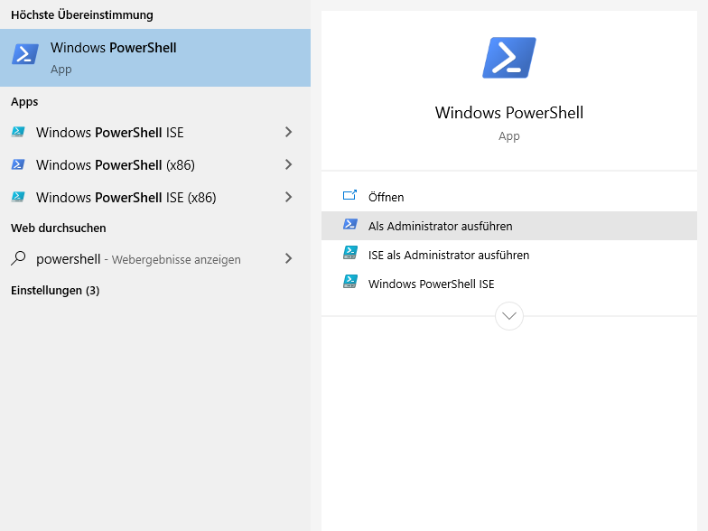
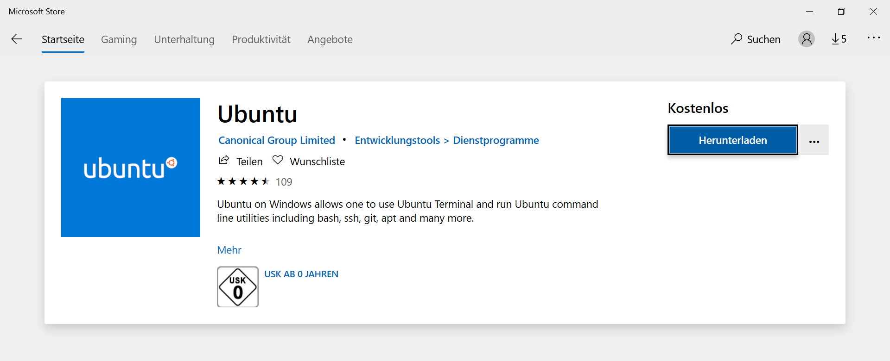
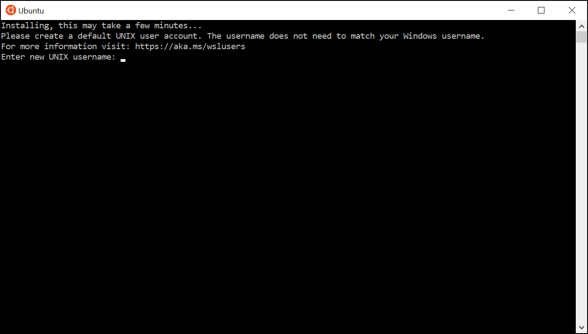

Setup Prerequisites
===================

To start with this course, you need the to install necessary programs and
setup your system to allow programming.
Depending on the platform and operating systems you are using the steps
differ but eventually you should be able to use the course material independently
of your platform.

.. important::

   If you are working at a CIP pool computer in the Mulliken Center for
   Theoretical Chemistry we have taken care for you about the setup
   and you can immediately continue with the next chapter.

.. contents::

Ubuntu
------

Starting with a fresh version of `Ubuntu 18.04`_ we have to install a few programs
first.
You have to install the packages: ``gfortran``, ``make``, ``atom`` and ``vim``.
We will assume you are working with ``apt`` to install packages, in case you
prefer another package manager, feel free to install the packages listed here
with this one (see `Ubuntu install & remove software`_).

.. _Ubuntu 18.04: http://releases.ubuntu.com/18.04.4/
.. _Ubuntu install & remove software: https://help.ubuntu.com/lts/ubuntu-help/addremove.html

.. code-block:: bash

   sudo apt install gfortran make atom vim

.. note::

   Some packages, especially ``vim`` and ``make`` might already be installed on
   your system, but it does not harm to include them here again.

After having installed the necessary software, you need to download the
`course material`_.
Unzip the ``course-material.zip`` archive to your home directory and
you are setup to start with the next chapter.

.. _course material: https://github.com/grimme-lab/qc2-teaching/releases/latest

Windows 10
----------

With Windows 10 comes the possibility to integrate a Linux Console to your Windows
PC via the Windows Subsystem for Linux (WSL). This is in particular useful for you
as a Windows user to participate in our Linux based course from home. This guide
will show you how to use WSL in order to install a Unix-based console that allows
you to complete all the tasks of the course (it is basically a shortened version
of the `Microsoft documentation for installing WSL`_).

.. _Microsoft documentation for installing WSL: https://docs.microsoft.com/en-us/windows/wsl/install-win10

Install WSL
~~~~~~~~~~~

In order to install WSL, you first have to enable the optional WSL feature. Open
the Windows PowerShell as administrator (for example by typing ``powershell`` in
the search field of the taskbar).

Type the following command in PowerShell and press ``<Enter>``:

.. code:: PowerShell

   Enable-WindowsOptionalFeature -Online -FeatureName Microsoft-Windows-Subsystem-Linux

Afterwards please restart your computer if you are asked to.

Install Linux Distribution
~~~~~~~~~~~~~~~~~~~~~~~~~~

You can now install a Linux distribution of your choice to use with WSL. We recommend
Ubuntu. You can install it from the Microsoft Store. Just type ``Ubuntu`` in the
search field and download the application.

After the installation was successful, you can start the Linux distribution. Ubuntu
will open a console and install itself. You will be ask to choose a username and
a password. Those are equivalent to the ones you would choose on a real Ubuntu machine.

Your new console will now show ``linuxusername@hostname:/some/path$``, similar to
an Ubuntu console. ``linuxusername`` is your chosen username in the Linux distribution
and ``hostname`` the name of your computer. The directory in which the window is
opened (``/some/path``) will probably be your Linux home directory ``~`` (see
:ref:`Shell in a nutshell`). Note that this home directory can not simply be accessed
via the Windows explorer. But the other way around, you can find your Windows home
directory in ``/mnt/c/Users/windowsusername``, where ``windowsusername`` is your
username on your Windows computer. If you want to open new files with some Windows
program, we recommend to create and save all new files in the mentioned directory
or subfolders of it.

You can now also access your Linux console through a Windows console such as CMD.
To open CMD, just type ``cmd`` in the search field of the Windows taskbar and press
``Enter``. By entering the command ``wsl`` or ``bash``, you will change to the Linux
console in your current directory which is your Windows home directory.

.. note::

   If you feel advanced in handling the shown terminals of different distributions
   on your Windows computer, you can try the `Windows Terminal`_. It allows you
   to manage your WSL terminals and may make your home office more comfortable.
   However, it is still a preview release and thus the installation might require
   some effort.

.. _Windows Terminal: https://github.com/Microsoft/Terminal

You have now successfully installed a Linux console on your Windows computer and
can continue with the Ubuntu part of this documentation.

