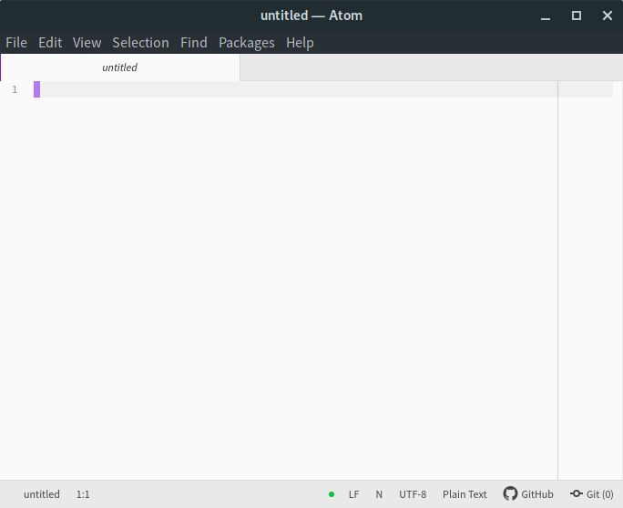
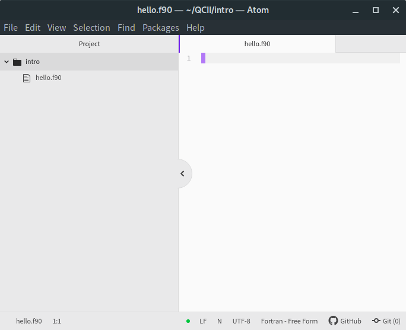
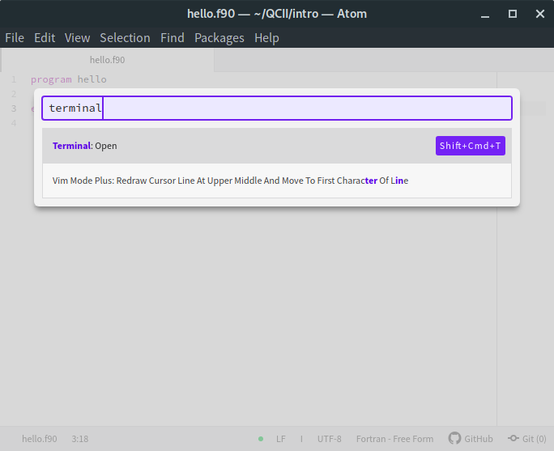
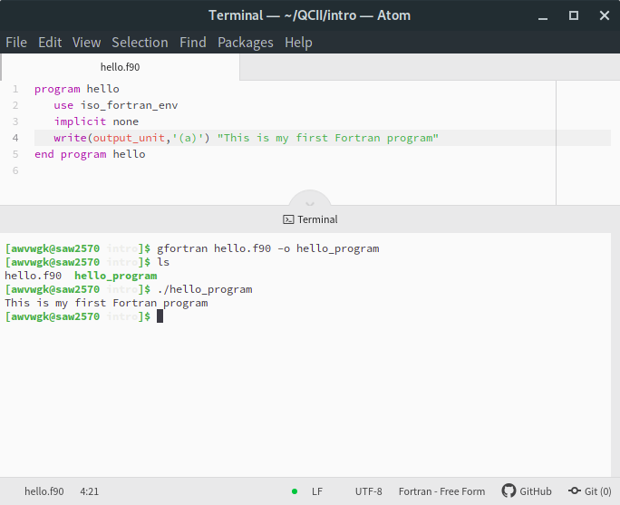

Working on Linux
================

As you participate in this lab exercise, you must have at
least a basic knowledge of working with a Linux computer.
This chapter shows you the basic commands to get along with your computational
environment.
First of all, you will be provided with a **username** and a **password**.
This represents your user account for the whole lab course and all the data you
produce is available with this information.

.. note::

   Some of the keyboard shortcuts in this chapter are targeted at the
   setup of the CIP Pool computers in the Mulliken Center for Theoretical
   Chemistry and might not work as expected for you.

   In case you use KDE, everything will probably work just fine, if you
   use another OS or window manager commands might differ slightly.

.. contents::

Login
-----

The first thing you will see after booting the computer is the *login-screen*.

Dependent on the Linux version you are using this screen may look slightly
different. After you typed in your username and password you press the
``<Return>`` key and the graphical desktop will be loaded. All further
actions will take place in this environment. The next and certainly most
important thing is to access the Linux command line. This is usually
done by starting a terminal-emulator, which is called
**shell** or **terminal**. On the machines you are using there should be a
quick start icon directly on the desktop. By clicking on this icon, a window is
opened which allows you to communicate with the PC in a command-line mode.

.. _Shell in a nutshell:

Shell in a nutshell
-------------------

After executing the terminal-emulator you will end up with a window, which
looks similar to the following image:

.. code-block:: none

   ehlert@c01:~> pwd
   /home/ehlert
   ehlert@c01:~> ls
   Desktop     Music      QCII
   Documents   Pictures   Templates
   Downloads   Public     Videos
   ehlert@c01:~> cd QCII
   ehlert@c01:~/QCII>

On the left, you can see the so-called **prompt**. Depending on the default
settings of your system it provides you with various information. In a
standard configuration, it will show: ``username@hostname:~>``,
where ``username`` is your username, ``hostname`` is the name of the
computer and the tilde (``~``) shows that you are currently located in
your **home directory** (``/home/username``).
The Linux file structure follows the *Filesystem Hierarchy Standard*,
which ensures a similar file structure on every version of Linux you can get.
As you work with the system you will rapidly gain experience with the different
directories and their purposes. For now, you should know that you are in your
home directory which is located at ``/home/username`` and is abbreviated by ``~``.

With your user account you have the power to create, edit, and delete files in
your home directory at will. But with great power comes great responsibility.
You have to be careful with the commands you execute when you delete or
overwrite a file it is gone for good.
With that in mind, we can now start with the first couple of commands.
To see exactly which directory you are in,
type ``pwd`` (print working directory) and press ``<Return>``.
Since you are in your home directory, this will print the path to that home
directory to the screen.
Note that all input in the terminal is case-sensitive.

.. code-block:: none

   ehlert@c01:~> pwd
   /home/ehlert

Next thing we want to know is what is inside our current location, for this
we use the command ``ls``, short for list:

.. code-block:: none

   ehlert@c01:~> ls
   Desktop     Music      QCII
   Documents   Pictures   Templates
   Downloads   Public     Videos

We can add options to the ``ls`` command like ``-l`` to use the
use a long listing format:

.. code-block:: none

   ehlert@c01:~> ls -l
   total 574500
   drwxr-xr-x  2 ehlert thch      4096 Jun  7  2018 Desktop
   drwxr-xr-x  2 ehlert thch      4096 Jun  7  2018 Documents
   drwxr-xr-x  2 ehlert thch      4096 Jun  7  2018 Downloads
   drwxr-xr-x  2 ehlert thch      4096 Jun  7  2018 Music
   drwxr-xr-x  2 ehlert thch      4096 Jun  7  2018 Pictures
   drwxr-xr-x  2 ehlert thch      4096 Jun  7  2018 Public
   drwxr-xr-x  4 ehlert thch      4096 Jan 14 09:09 QCII
   drwxr-xr-x  2 ehlert thch      4096 Jun  7  2018 Templates
   drwxr-xr-x  2 ehlert thch      4096 Jun  7  2018 Videos

Alternatively we can provide ``ls`` with a path, it will then list all the
files within this directory

.. code-block:: none

   ehlert@c01:~> ls QCII
   tutorial   scf

Of course we can also combine options and paths for ``ls``.

You might wonder what a path is, we will go into more detail above them now
as they are important for working with Linux. Whenever we refer to a file or
a directory on the commandline we are in fact referring to its path.
A path is identifying a particular file or directory on the system.
Your filesystem starts at the root ``/`` and can be referenced absolutely
from this root or relative from your current working directory.
Every directory has at least two links to other directories, to itself ``.`` (dot)
and to its parent ``..`` (dotdot), which can be used to build paths to reference
to any file or directory on your system.

Up to now we only looked around, but we can also change the directory, which
is done by the command ``cd``, short for change directory.

.. code-block:: none

   ehlert@c01:~> cd QCII
   ehlert@c01:~/QCII> cd .
   ehlert@c01:~/QCII> cd ../..
   ehlert@c01:/home> cd -
   /home/ehlert/QCII
   ehlert@c01:~/QCII> cd
   ehlert@c01:~>

What did just happen?

1. We changed to the QCII directory.
   Our prompt helpfully reports that we are now in the QCII directory, so usually
   there is no need to use ``pwd``.
2. Next we change to the directory itself using its dot link, and we stay in the
   same directory as expected.
3. Now we change to the parent directory of the QCII parent directory, which
   is the parent directory of our home directory.
   You can easily chain links together using the slash character ``/``.
4. In case a change directory brings you to the wrong place you can always go
   back to the last directory you visited by ``cd -``.
   The absolute path of the directory is also printed so we can be sure to be
   in the right place.
5. To go back to your home directory use ``cd`` without an argument.

We differenciated files and directories above, which is not quite true, in Linux
everything is a file, also a directory, even your keyboard is a file (one which
is only read from), your monitor is also a file (one which is only written to).
It will not affect us when working with Linux but it is helps to keep it in mind
when trying to understand how Linux manages files and directories.

A standard set of commands is shown in the following table:

+-----------------------+----------------------------------------------+
|  command              | description                                  |
+=======================+==============================================+
| ``pwd``               | print the working directory                  |
+-----------------------+----------------------------------------------+
| ``ls``                | lists the files in the current directory     |
+-----------------------+----------------------------------------------+
| ``cd <name>``         | change to the directory with ``<name>``      |
+-----------------------+----------------------------------------------+
| ``cd ..``             | change to the parent directory               |
+-----------------------+----------------------------------------------+
| ``cp <old> <new>``    | copy file ``<old>`` to ``<new>``             |
+-----------------------+----------------------------------------------+
| ``cp -r <old> <new>`` | copy directory ``<old>`` to ``<new>``        |
+-----------------------+----------------------------------------------+
| ``mv <old> <new>``    | move (rename) file/directory                 |
+-----------------------+----------------------------------------------+
| ``rm <name>``         | remove file with ``<name>``                  |
+-----------------------+----------------------------------------------+
| ``rm -r <name>``      | remove directory recursively (caution!)      |
+-----------------------+----------------------------------------------+
| ``mkdir <name>``      | make a new directory with ``<name>``         |
+-----------------------+----------------------------------------------+
| ``rmdir <name>``      | remove (empty) directory with ``<name>``     |
+-----------------------+----------------------------------------------+

This is only a very basic list of commands available and some of them have a
huge variety of options that can not be listed here, and will hardly concern you.
For all options the program can be started with ``<command> --help`` and
a complete summary can be found in its manual page by ``man <command>``.

.. admonition:: Exercise 1

   To get familiar with the shell try to achieve the following task

   1. change to the ``QCII`` directory
   2. find or create the ``tutorial`` directory in ``QCII``
   3. rename the ``tutorial`` directory to ``shell tutorial``
   4. change to the newly created directory

.. admonition:: Solutions 1
   :class: tip

   A sequence of this command would achieve the wished results.

   .. code-block:: none

      username@hostname:~> cd QCII
      username@hostname:~/QCII> ls tutorial
      tutorial
      username@hostname:~/QCII> mv tutorial shell tutorial
      mv: cannot move 'tutorial' to a subdirectory of itself, 'tutorial/tutorial'
      mv: cannot stat 'shell': No such file or directory
      username@hostname:~/QCII> mv tutorial 'shell tutorial'
      username@hostname:~/QCII> cd shell\ tutorial
      username@hostname:~/QCII/shell tutorial>

   Note that you have to escape the space in ``shell tutorial`` in some way.

Editors
-------

To access and edit any text file in Linux you will need an editor. A huge variety
of editors exist and your difficult task is to pick the one you are most
comfortable with. We introduce the most common ones in this chapter, but feel
free to work with the editor that fits you the best.

VSCode
~~~~~~

``vscode`` is a powerful, cross-platform source code editor. It benefits from 
a rich ecosystem of extensions that provides support for all common programming
languages including features like syntax highlighting, intellisense and many 
more. It is well suited for large programming projects and the preferred choice
in our group.

The installation instructions can be found
`here <https://code.visualstudio.com/docs/setup/linux>`_.

Since you will be writing Fortran code, you want to install the *Modern Fortran*
extension, which you can find via the extensions tab (Ctrl+Shift+X) within
VSCode. For additional features, check out the `Language Server Integration  <https://github.com/fortran-lang/vscode-fortran-support#language-server-integration>`_.

You can also install a Vim emulator (see below) for VSCode to enable most of Vim's functionalities.

Atom
~~~~

.. attention::

  Since December 15, 2022, atom is not maintained anymore. Nevertheless, you 
  can still download and use it.

``atom`` is a similar to ``vscode``, i.e., a rather heavyweight but easy-to-use 
editor. It is built on-top of the ``electron`` framework and has comparable capabilities to a web browser. It is available for Linux, macOS and Windows.
Since we are dealing here with electrons and atoms the choice of programs
could not have been better, unfortunately, they do not know much about quantum
chemistry.
You can work entirely in ``atom``, but you need some extensions which
might already be installed with your version of ``atom``.
If not install ``language-fortran``, ``build``, ``build-make`` and ``terminal-tab``
at the setting menu ``<ctrl>-<,>`` under *install*.
``atom`` can be easily extended to a complete integrated development environment,
but we will assume you are working with a vanilla version including the four
additional packages here.

Start ``atom`` by using ``<alt>-<F2>`` and typing atom in the quick launch bar
or searching the start menu for ``atom``.

Having started a new instance of ``atom`` you either have already an empty
file opened or you can open a new file by ``<ctrl>-<n>``, save the file
with ``<ctrl>-<s>`` by creating a new directory and giving the file a name there,
if you name the file ``hello.f90`` it will be automatically identified as
Fortran source code.

You can start a shell by hitting ``<ctrl>-<shft>-
`` and typing ``terminal``
in the quick launcher of ``atom`` the shell can be used for all commands you
previously learned.

.. note::

   If you are using atom in Windows and have installed WSL, you can start a
   Unix shell by typing ``wsl`` or ``bash`` in the command line of the terminal
   you just opened in ``atom``.

Later you can use it to compile and execute your programs without leaving
your editor. For example, we write a simple Fortran program to print a line
to the screen, save it and compile it using ``gfortran`` in our shell inside
``atom``.

Vim
~~~

``vim`` is a very powerful and lightweight editor, once you have mastered the 
initial steep learning curve. It has the advantage of being installed by 
default on almost any Linux machine and is even fully usable without a 
graphical user interface.

However, getting past the initial learning curve can take the better part of a
month, but having truly mastered ``vim`` usually results in a huge performance
gain when developing. We encourage you to pick up ``vim`` instead of ``atom``.

To get started with ``vim`` open a new terminal (type ``<alt>-<F2>`` for the
quick launch menu, then type ``konsole`` or search for it in the menu) and
type ``vimtutor``.
This will launch an instance of ``vim`` with an extensive introduction for using
it, follow the instructions until you feel confident navigating and editing files
with ``vim``.

.. attention::
   Don't read past this note without finishing ``vimtutor``!

To make working with ``vim`` easier for you, we provide this ``.vimrc`` for you:

.. literalinclude:: ../config/.vimrc
   :caption: ~/.vimrc
   :language: vim

In case it is not yet in your ``.vimrc`` we recommend copying, if you are
not happy with something we put in here, feel free to modify or replace it,
you can also add new configurations if you like.

After you have covered the basics, there are some tricks you might find useful.

.. tip::

   We recommend working with a *single* instance of ``vim`` in *one* terminal,
   if used right ``vim`` can provide all functions from your file navigator
   and terminal.

1. Open your current working directories with ``vim .`` and you will find yourself
   in the ``netrw`` file navigator.
2. Navigate to a file you would like to open and hit ``<Enter>``, it will be opened
   in the same ``vim`` instance, to get back type ``:E`` in normal mode and find
   yourself back in ``netrw``.
3. To open a new window type ``<ctrl>-w n``, you can close the window again
   with ``<ctrl>-w q`` or by typing ``:q`` as usual.
4. To open a second window you can split your ``vim`` window by using ``<ctrl>-w v``
   (for vertical splitting) or ``<ctrl>-w s`` (for horizontal splitting) to have
   two windows with the same file which can be used independently.

.. tip::

   If your ``vim`` instance freeze, you hit ``<ctrl>-s`` by accident, which
   tells the hosting terminal to freeze, unfreeze it with ``<ctrl>-q``.

5. If you have your mouse enabled for ``vim`` you can jump between windows
   by clicking into another window, the faster way is to use ``<ctrl>-w w``
   to go to the next window.

Make yourself familiar with navigation between multiple windows by creating,
closing and jumping between multiple windows.
You can yank and paste content between the windows that way, which allows
seamless transfer between different files.

6. Now go in one of the windows back to ``netrw``, we want to create a new
   directory without using ``:!mkdir ...``, type ``d`` in normal mode in your
   ``netrw`` instance and you should be prompted to provide a name.
7. You can delete it again with ``D``, do so by moving your cursor over the file
   or directory and press ``D``, then accept your choice in the prompt.
8. Now we want a new file, the easiest way would be ``:e ...``, but this path
   has to be relative from the working directory we started our ``vim`` instance
   in, so we use ``netrw`` instead and type ``%`` which prompts as to provide
   a name and opens the new file afterward in a new ``vim`` window.

Let's open a new file ``hello.f90`` and enter

.. code-block:: fortran
   :linenos:

   program hello
      implicit none
      write(*, '(a)') "My first Fortran program"
   end program hello

.. tip::

   In case the syntax highlighting looks strange, ``vim`` is trying to use
   Fortran 77 highlighting, add ``let fortran_free_source=1`` to your ``.vimrc``
   to get the correct Fortran 90 highlighting and restart ``vim`` for it to
   take effect.

After saving the file, compile and run it by typing ``:!gfortran % && ./a.out``,
you should see something like this printout in your terminal:

.. code-block:: none

   My first Fortran program

   Press ENTER or type command to continue

The first line is from your program, the second one is produced by ``vim``.

.. note::

   To switch between your terminal and ``vim`` use ``<ctrl>-z`` to stop ``vim``
   and get it back from the terminal by using the command ``fg``.

At this point, you should be ready to use ``vim`` in production, happy coding.
