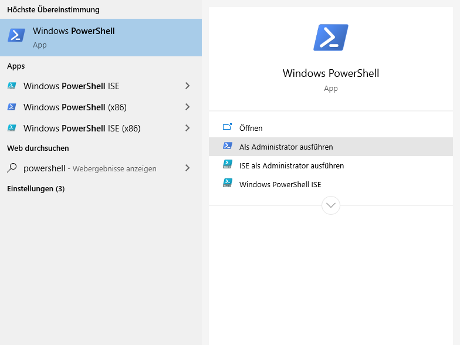
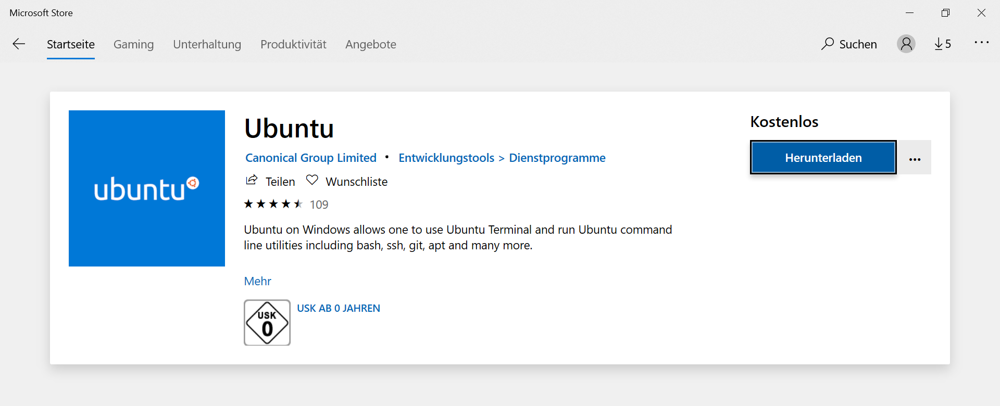
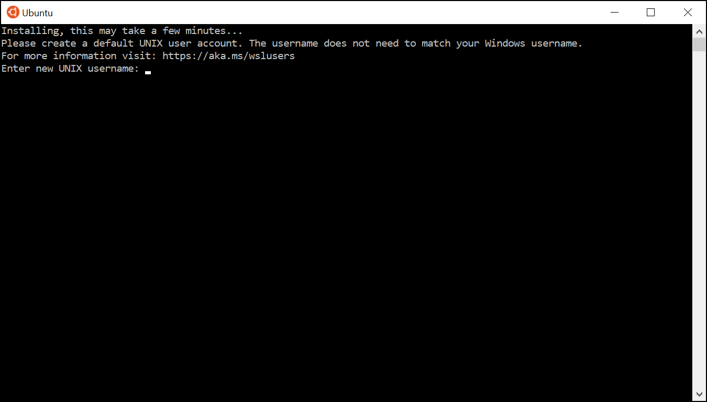

Setup Prerequisites
===================

To start with this course, you need the to install necessary programs and
setup your system to allow programming.
Depending on the platform and operating systems you are using the steps
differ but eventually you should be able to use the course material independently
of your platform.

.. important::

   If you are working at a CIP pool computer in the Mulliken Center for
   Theoretical Chemistry we have taken care for you about the setup
   and you can immediately continue with the next chapter.

.. contents::

Windows
-------

There are multiple ways to enable your Windows (10 or higher) system for development.
For this course we will present two methods, either running natively
(see :ref:`msys2`) or with a virtualisation of a Linux subsystem (see :ref:`wsl`).

.. _msys2:

Install MSYS2
~~~~~~~~~~~~~

The `MSYS2 project <https://www.msys2.org>`_ provides a package manager and
makes many common Unix tools available for Windows.
It comes with its own bash-like shell which allows to easily follow this course.

Download the ``msys2-x86_64-YYYYMMDD.exe`` installer from the MSYS2 webpage
and run the installer. MSYS2 will create several new desktop shortcuts called environments:
*MSYS*, *MinGW64*, *UCRT64*, etc. (more information
on MSYS2 environments is available `here <https://www.msys2.org/docs/environments>`_).

To run installed environments (we recommend *MinGW64* for this course), you can either use the 
default MSYS terminal emulator mintty by clicking on the corresponding shortcut, or use external 
terminal emulators (more information is available `here <https://www.msys2.org/docs/terminals>`_).

Open a new terminal and update your installation with

.. code-block:: bash

   pacman -Syu

You might have to update MSYS2 and ``pacman`` first, restart the terminal and run
the above command again to update the installed packages.

If you are using the *MinGW64* environment, you can install the required software with

.. code-block:: bash

   pacman -S git mingw-w64-x86_64-gcc-fortran mingw-w64-x86_64-make mingw-w64-x86_64-fpm vim

If you use the *MSYS* environment leave out the ``mingw-w64-x86_64`` prefixes to install
the required software.

.. _wsl:

Install WSL
~~~~~~~~~~~

With Windows 10 comes the possibility to integrate a Linux Console to your Windows
PC via the Windows Subsystem for Linux (WSL). This is in particular useful for you
as a Windows user to participate in our Linux based course from home. This guide
will show you how to use WSL in order to install a Unix-based console that allows
you to complete all the tasks of the course (it is basically a shortened version
of the `Microsoft documentation for installing WSL`_).

.. _Microsoft documentation for installing WSL: https://docs.microsoft.com/en-us/windows/wsl/install-win10

In order to install WSL, you first have to enable the optional WSL feature. Open
the Windows PowerShell as administrator (for example by typing ``powershell`` in
the search field of the taskbar).

Type the following command in PowerShell and press ``<Enter>``:

.. code:: PowerShell

   Enable-WindowsOptionalFeature -Online -FeatureName Microsoft-Windows-Subsystem-Linux

Afterwards please restart your computer if you are asked to.

Install Linux Distribution
~~~~~~~~~~~~~~~~~~~~~~~~~~

You can now install a Linux distribution of your choice to use with WSL. We recommend
Ubuntu. You can install it from the Microsoft Store. Just type ``Ubuntu`` in the
search field and download the application.

After the installation was successful, you can start the Linux distribution. Ubuntu
will open a console and install itself. You will be ask to choose a username and
a password. Those are equivalent to the ones you would choose on a real Ubuntu machine.

Your new console will now show ``linuxusername@hostname:/some/path$``, similar to
an Ubuntu console. ``linuxusername`` is your chosen username in the Linux distribution
and ``hostname`` the name of your computer. The directory in which the window is
opened (``/some/path``) will probably be your Linux home directory ``~`` (see
:ref:`Shell in a nutshell`). Note that this home directory can not simply be accessed
via the Windows explorer. But the other way around, you can find your Windows home
directory in ``/mnt/c/Users/windowsusername``, where ``windowsusername`` is your
username on your Windows computer. If you want to open new files with some Windows
program, we recommend to create and save all new files in the mentioned directory
or subfolders of it.

You can now also access your Linux console through a Windows console such as CMD.
To open CMD, just type ``cmd`` in the search field of the Windows taskbar and press
``Enter``. By entering the command ``wsl`` or ``bash``, you will change to the Linux
console in your current directory which is your Windows home directory.

.. note::

   If you feel advanced in handling the shown terminals of different distributions
   on your Windows computer, you can try the `Windows Terminal`_. It allows you
   to manage your WSL terminals and may make your home office more comfortable.
   However, it is still a preview release and thus the installation might require
   some effort.

.. _Windows Terminal: https://github.com/Microsoft/Terminal

You have now successfully installed a Linux console on your Windows computer and
can continue with the Ubuntu part of this documentation (see :ref:`ubuntu`).

.. _ubuntu:

Ubuntu
------

Starting with a fresh version of `Ubuntu 18.04`_ we have to install a few programs
first.
You have to install the packages: ``git``, ``gfortran``, ``make``, and ``vim``.
We will assume you are working with ``apt`` to install packages, in case you
prefer another package manager, feel free to install the packages listed here
with this one (see `Ubuntu install & remove software`_).

.. _Ubuntu 18.04: http://releases.ubuntu.com/18.04.4/
.. _Ubuntu install & remove software: https://help.ubuntu.com/lts/ubuntu-help/addremove.html

.. code-block:: bash

   sudo apt install git gfortran make vim

.. note::

   Some packages, especially ``vim`` and ``make`` might already be installed on
   your system, but it does not harm to include them here again.

For the programming course we recommend to use the Fortran package manager (fpm),
which can be downloaded from `here <https://github.com/fortran-lang/fpm/releases>`_.
or setup from conda-forge as described in :ref:`fpm from conda`.

After having installed the necessary software, you need to download the
`course material`_.
Unzip the ``course-material.zip`` archive to your home directory and
you are setup to start with the next chapter.

.. _course material: https://github.com/grimme-lab/qc2-teaching/releases/latest

.. tip::

   The content of the archive might be potentially important as a starting
   point for your SCF program later.

.. _fpm from conda:

Fortran package manager from conda
~~~~~~~~~~~~~~~~~~~~~~~~~~~~~~~~~~

You can install the Fortran package manager (fpm) easily from conda-forge,
a large scientific software repository. To do so, download a mambaforge installer
from the `conda-forge project <https://github.com/conda-forge/miniforge/releases/latest>`_.
For Ubuntu ``Mambaforge-Linux-x86_64.sh`` is the correct choice.
Run the installer as user (no sudo required) to setup your conda base environment:

.. code-block:: bash

   sh Mambaforge-Linux-x86_64.sh

Your prompt should now show a ``(base)`` label in front, which signals you that you
now have access to the mamba package manager and the conda environment manager.

.. note::

   Those two tools, mamba and conda, are very powerful to create reproducable
   development and production environments for scientific work.
   For this course they allow us to easily install software, that would be difficult
   to install otherwise or software which is not yet available in all Linux distributions.
   Many of our groups software is available over conda-forge as well.

To add Fortran package manager (fpm) to your base environment run

.. code-block:: bash

   mamba install fpm

.. tip::

   Alternatively, you can create a separate environment for fpm with

   .. code-block:: bash

      mamba create -n fpm fpm
      conda activate fpm

   When creating a separate environment, you will always have to activate it after
   starting a new shell, but it allows you more fine grained control over
   your installed software.

MacOS
-----

To setup your MacOS for the course follow this steps

1. Install Xcode from the the App Store
2. Open a terminal from /Applications/Utilities/
3. Install command line tools with

   .. code-block:: bash

      xcode-select --install

4. Install ``gfortran`` either by installing it from `here <https://gcc.gnu.org/wiki/GFortranBinariesMacOS>`_
   or by using Homebrew (see :ref:`gfortran from homebrew`)
5. Install the Fortran package manager from conda (see :ref:`fpm from conda`)
   or homebrew (see :ref:`gfortran from homebrew`)

.. important::

   The default shell on MacOS is not ``bash``, but a ``zsh``, but they should
   be mostly compatible. In case you want to follow the course with a ``bash``
   start a new ``bash`` instance after opening your terminal with

   .. code-block:: bash

      exec bash

After having installed the necessary software, you need to download the
`course material`_.
Unzip the ``course-material.zip`` archive to your home directory and
you are setup to start with the next chapter.

.. note::

   Some of the keyboard shortcuts in the next chapter are targeted at
   Linux OS, you probably have to use the ``cmd`` key instead of the
   ``ctrl`` key.

.. _gfortran from homebrew:

Installing with Homebrew
~~~~~~~~~~~~~~~~~~~~~~~~

You can manage packages for your Mac using `homebrew <https://brew.sh>`_.
To install homebrew download the installation script from the official
homebrew channel at GitHub:

.. code-block:: bash

   curl -fsSL https://raw.githubusercontent.com/Homebrew/install/master/install.sh > install-homebrew.sh
   /bin/bash install-homebrew.sh

The script will ask you a few questions to complete the installation process,
for more information on the homebrew installation check their
`documentation <https://docs.brew.sh/Installation>`_.

To install ``gfortran`` we will install the ``gcc`` formula, where it is
included, with

.. code-block:: bash

   brew install gcc

Additionally, install the Fortran package manager (fpm) with

.. code-block:: bash

   brew tap awvwgk/fpm
   brew install fpm
